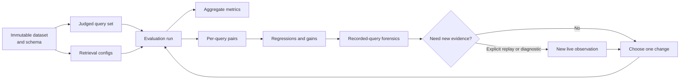
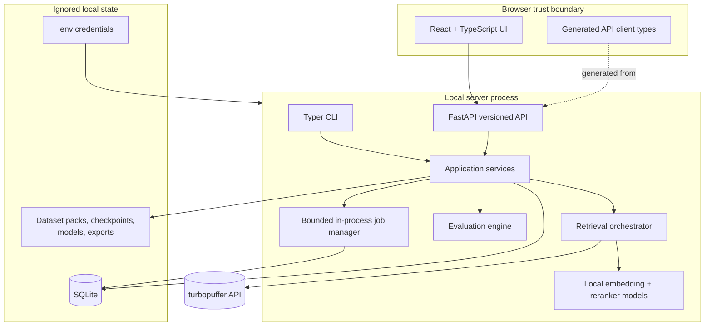
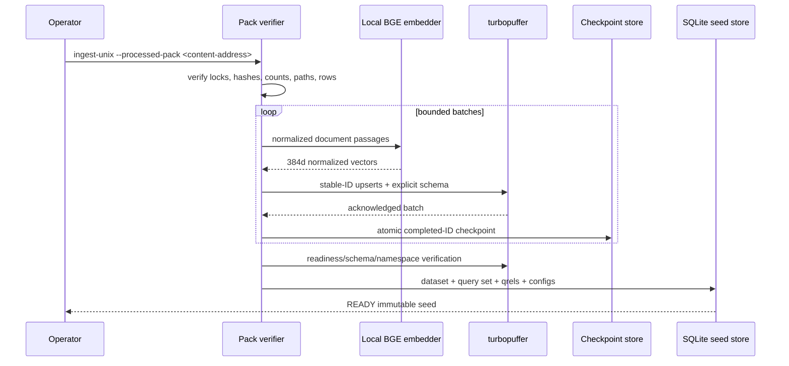

# PufferLab: complete study and presentation guide

This is the one document to study before explaining, demonstrating, operating, or extending
PufferLab. It describes the product that is actually implemented through Milestone 5, not an
aspirational version of it. Detailed contracts and runbooks remain linked where repeating them
would make this guide harder to maintain.

## How to use this guide

If you have limited time:

- **Five minutes:** read [The short explanation](#the-short-explanation),
  [What was implemented](#what-was-implemented), and
  [What PufferLab proves](#what-pufferlab-proves).
- **Fifteen minutes:** add [The product workflow](#the-product-workflow),
  [System architecture](#system-architecture), and
  [How to present it](#how-to-present-it).
- **Before a live demo:** read [Run PufferLab locally](#run-pufferlab-locally),
  [Demo script](#demo-script), and [Demo recovery](#demo-recovery).
- **Before a technical review:** read the retrieval, evaluation, evidence, safety, and testing
  sections, then use the [code-reading map](#code-reading-map).

When a claim in this guide and the implementation appear to disagree, the checked-in contract,
test, and source code on `main` are authoritative. [`docs/progress.md`](progress.md) records the
delivery history and verification evidence.

## The short explanation

### In one sentence

PufferLab is a local search-evaluation and query-forensics workbench for turbopuffer: it runs a
representative judged query set against multiple retrieval configurations, shows which changes
helped or hurt, and lets an engineer inspect the observable evidence behind an individual result.

### The 60-second version

A generic search playground can show that a query returns results, but it cannot answer the more
important customer question: **did this search change improve quality across my workload, and what
should I investigate when it did not?**

PufferLab answers that question with a repeatable loop:

> **Configure → Evaluate → Find regressions → Inspect evidence → Change one variable → Re-run**

It compares four production-shaped retrieval strategies—weighted BM25, vector ANN, server-side
hybrid RRF, and hybrid retrieval followed by a local cross-encoder reranker. It evaluates them with
explicit relevance judgments, persists the run to SQLite, computes aggregate and per-query quality
metrics, ranks the largest regressions and gains, and provides stable deep links into a forensic
view. Stored-run exploration is provider-free. New turbopuffer work happens only after a clearly
labeled, explicit live action.

### The five-minute version

PufferLab is designed around the work of a deployed engineer helping a customer evaluate search:

1. Materialize an immutable dataset revision, query-set revision, relevance judgments, and
   retrieval configurations.
2. Execute every query/configuration pair and durably store the ranked outcomes and timing.
3. Compute NDCG@10, Recall@50, MRR@10, error/coverage rates, and p50/p95 client wall-clock latency.
4. Compare a candidate to a baseline using the same queries; do not hide missing, failed, or
   unjudgeable pairs.
5. Sort the per-query deltas to find the failures hidden by aggregate averages.
6. Open a failure in the query-forensics UI. Distinguish stored evidence, new live observations,
   counterfactual probes, and client-computed arithmetic.
7. If a known relevant document is missing, explicitly run the expected-document diagnostic to
   learn whether the document is retrievable by exact ID, matches the locally evaluable filter,
   appears in observed lexical/vector candidate lists, or lies outside the observed cutoff.
8. Change one controlled variable and repeat. A provider-free CLI gate can enforce a quality policy
   against an already completed run in CI or an operator workflow.

The key design principle is **evidence honesty**. PufferLab does not invent a provider query plan,
claim to know cache tier, label client timing as server timing, or present an embedding/reranker
score as model reasoning.

## What PufferLab proves

PufferLab demonstrates that its author can:

- translate an ambiguous customer problem into a narrow, useful evaluation product;
- model datasets, query sets, qrels, configurations, and experiments as immutable revisions;
- integrate safely with a real search provider while keeping credentials server-side;
- build lexical, vector, hybrid, and reranked retrieval through one typed boundary;
- implement and test information-retrieval metrics with explicit edge-case semantics;
- diagnose per-query regressions instead of relying only on top-line averages;
- design observability around what a public API actually exposes;
- build a durable local operator workflow with recovery, cancellation, export, cleanup authority,
  and provider-free readiness checks;
- generate frontend API types from the backend OpenAPI contract;
- deliver through small reviewed branches with independent verification and protected-branch CI.

It does **not** prove that one retrieval strategy always wins, that the recorded latency is a
turbopuffer service-level benchmark, or that a single 50-query workload represents every customer.

## Product problem and user

The primary user is a deployed engineer—or a customer engineer working with one—who has:

- representative documents;
- representative queries;
- explicit relevance judgments, even if the set is initially small;
- two or more retrieval configurations to compare;
- a need to explain both aggregate movement and individual failures.

Their job-to-be-done is:

> Given a representative workload and relevance judgments, tell me whether a candidate search
> configuration is better than the baseline, identify the queries it hurts, and give me enough
> observable evidence to choose the next experiment.

That framing led to a deliberate product decision: the evaluation dashboard and regression table
are the center of the product; the playground is the attached investigation surface. PufferLab is
not primarily a search box with attractive result cards.

## The product workflow



The important distinction in this loop is between **reading an experiment** and **running new
provider work**:

- Opening run history, a regression, a query, or a document drawer reads SQLite-backed evidence.
- Live compare, replay, and expected-document diagnosis are explicit actions with separate source
  labels and timing.
- Page load, refresh, Back/Forward, and control changes do not silently trigger provider work.

## What was implemented

### Milestone 0 — contracts and scaffold

Milestone 0 established the versioned Pydantic contracts, FastAPI/OpenAPI boundary, generated
TypeScript types, Python and React scaffolds, health endpoint, deterministic generation checks, and
secret boundary. This made the API schema the source of truth before backend and frontend features
diverged.

### Milestone 1 — thin live vertical slice

Milestone 1 connected the browser to FastAPI and the server to turbopuffer, added the synthetic
20-document fixture, safe generated-tiny namespace ownership, BM25/vector comparison, client
timing, provider error redaction, and an optional real-provider verification path. It proved the
complete browser → API → provider → API → browser loop while keeping the API key off the client.

### Milestone 2 — useful evaluation core

Milestone 2 added the pinned CQADupStack Unix preparation and ingestion pipeline, four immutable
retrieval configurations, BGE embeddings, server RRF, local cross-encoder reranking, judged
evaluation metrics, paired regression analysis, durable SQLite persistence, resumable ingestion,
run execution, and safe export. It turned the vertical slice into a repeatable experiment system.

### Milestone 3 — interview-ready product

Milestone 3 added the run list and run-detail dashboard, aggregate comparison, regression/gain
controls, stable deep links, recorded-query forensics, evidence-source labeling, synthetic demo
data, robust UI states, and a provider-free presentation workflow. It made the evaluation core
understandable without reading database rows or JSON exports.

### Milestone 4 — operator-ready workflow

Milestone 4 added guided capabilities and `doctor`, authenticated cleanup for PufferLab-owned tiny
namespaces, durable run recovery and cancellation hardening, provider-free `eval gate`, explicit
export/cleanup boundaries, accessibility/browser verification, and an operator runbook. It made
the project reproducible by a reviewer without oral setup instructions.

### Milestone 5 — exact-bound expected-document diagnosis

Milestone 5 added a dedicated explicit live diagnostic for a positively judged document in a
recorded query. It binds the request to the exact run, query, document, and configuration, uses one
strong-consistency turbopuffer multi-query with no SDK retry, and reports bounded evidence about
direct document availability, stored-filter truth where locally evaluable, lexical/vector candidate
membership, cutoff position, and an optional no-filter counterfactual. It preserves the same
observability boundary as the rest of the product.

The detailed milestone plans are in [`docs/implementation-plan.md`](implementation-plan.md),
[`docs/milestone-4-execution.md`](milestone-4-execution.md), and
[`docs/milestone-5-execution.md`](milestone-5-execution.md). The merged branch/PR record is in
[`docs/progress.md`](progress.md).

## System architecture

PufferLab is intentionally a local, single-user system. It avoids production infrastructure that
would not improve the demonstration.



### Why this shape

- **FastAPI is the composition root.** The browser never receives provider credentials and never
  calls turbopuffer directly.
- **Application services own workflows.** API routes and CLI commands reuse the same domain logic
  instead of growing separate implementations.
- **SQLite is the durable source of truth.** In-memory jobs can disappear; completed outcomes and
  state transitions do not.
- **One server worker is deliberate.** The local job manager and exclusive database guard are
  designed for one owner, not horizontally scaled workers.
- **Local models are lazy.** Provider-free demo/read/gate paths do not download or initialize an
  embedding model or reranker.
- **OpenAPI is checked in.** The TypeScript client types are generated from backend contracts, and
  CI fails on drift.

### Process and trust boundaries

There are four boundaries to remember:

1. **Browser:** may receive query text, result attributes, and sanitized evidence required by the
   UI; never receives the API key, raw vectors, `.env`, or unrestricted provider responses.
2. **Local server:** owns credentials, provider clients, local model execution, contract validation,
   and allowlisted response construction.
3. **Ignored local state:** SQLite, licensed corpus text, qrels, processed packs, checkpoints,
   model caches, exports, logs, and live evidence stay outside Git.
4. **Provider:** sees only explicitly executed live requests. Stored-run reading and the synthetic
   demo do not call it.

## The domain model

PufferLab makes experiments reproducible by binding results to immutable identities.

| Concept | Meaning | Why it matters |
|---|---|---|
| Dataset version | Corpus revision plus namespace, corpus hash, schema/index profile, and readiness | Results must not silently move when data or schema changes. |
| Query set | Ordered revision of queries and qrels bound to one dataset | Every configuration is judged against the same workload. |
| Qrel | Query/document pair with a non-negative relevance grade | Quality is grounded in authored or official judgments. |
| Retrieval config | Immutable, hashed retrieval specification and revision | A friendly name cannot hide a changed parameter. |
| Eval run | Query set, baseline, candidates, environment, lifecycle, and summaries | It is the experiment envelope. |
| Query outcome | One query/config attempt with rank evidence, metrics or error, and optional timing | Failures and missing evidence remain explicit. |
| Paired delta | Candidate minus baseline for the same query | Per-query comparison avoids mixing different populations. |
| Evidence source | Stored run, live replay, counterfactual probe, diagnostic, or client computation | The UI can state where every claim came from. |

Stable UUIDs and content/configuration hashes are derived from immutable inputs. Persistence rejects
identity or binding drift. A completed run is treated as evidence, not as a mutable dashboard row.

### SQLite records

The local database stores:

- `dataset_versions`;
- `retrieval_configs`;
- `query_sets` and ordered `judged_queries`;
- normalized `qrels`;
- `eval_runs` and their ordered baseline/candidate `run_configs`;
- one `query_outcome` for each run/config/query attempt.

Typed payload JSON preserves the full versioned contract while indexed relational columns support
identity, ordering, foreign-key, and lifecycle constraints. The database is located at
`$PUFFERLAB_DATA_DIR/pufferlab.sqlite3`.

## Datasets and ingestion

### Synthetic tiny fixture

The checked-in fixture contains 20 PufferLab-authored Unix troubleshooting documents and queries.
It is CC0-1.0, safe for tests and demonstrations, and has an explicit schema manifest. Live tiny
ingestion embeds the documents locally and writes them to a generated, PufferLab-owned namespace.

The fixture is useful for validating integration mechanics. It is not evidence of real-world
retrieval quality.

### CQADupStack Unix

The main evaluation workload uses the Unix subset of CQADupStack distributed through BEIR. The
repository intentionally does **not** contain the licensed source text, qrels, embeddings, or
vectors. Instead it contains:

- a pinned acquisition/source lock;
- whole-archive MD5 and SHA-256 checks;
- an exact ZIP member inventory;
- a deterministic transformation specification;
- a separately reviewed processed-pack commitment;
- an ID-only deterministic curated-50 manifest;
- source attribution and conservative license metadata.

The verified processed corpus contains 47,382 documents. The selected suite contains 50 queries
and, in the recorded live run, 83 positive query/document judgments. Selection covers exact-token,
semantic, hybrid, and multi-judgment reranking cases without checking source text into Git.

Read [`docs/datasets/cqadupstack-unix.md`](datasets/cqadupstack-unix.md) before preparing or
rebuilding this dataset.

### Ingestion sequence



Important properties:

- Document IDs are deterministic UUIDv5 values derived from dataset revision and source ID.
- A restart authenticates the checkpoint against namespace, dataset revision, corpus hash, schema
  hash, and completed IDs before resuming.
- Replayed batches are stable-ID upserts.
- Schema and model revisions are explicit; defaults cannot silently change a run.
- A namespace becomes `READY` only after the observed remote schema/readiness matches the compiled
  expectation.
- Caller-supplied Unix namespaces have no deletion path in PufferLab.

## Retrieval configurations

The seeded suite changes the retrieval pipeline while holding the dataset and judgments fixed.
Defaults for the full dataset are `result_k=50`, `candidate_k=100`, strong consistency, RRF
`rank_constant=60`, equal RRF weights, and reranker depth 50.

### 1. Weighted BM25

BM25 searches explicit `title` and `body` full-text fields with a pinned tokenizer and BM25 profile.
It is strongest when a query contains discriminative lexical anchors. Its observed score is useful
within the BM25 ranking; it should not be numerically compared with cosine distance or reranker
scores.

### 2. Vector ANN

The query is encoded with pinned `BAAI/bge-small-en-v1.5` into a normalized 384-dimensional vector.
The query encoder uses the model's retrieval instruction prefix while document passages remain
unprefixed. Models are exact-revision, lazy-loaded, dimension/finite-value checked, and serialized
behind local locks. turbopuffer performs approximate nearest-neighbor retrieval using cosine
distance over the `f16` `vector` attribute. Lower distance is better. Vector retrieval helps
semantic matches whose wording differs from the query.

### 3. Server-side hybrid RRF

Lexical and vector subqueries execute in one turbopuffer multi-query against the same consistent
snapshot. Server-side weighted reciprocal-rank fusion combines ranks rather than incomparable raw
scores:

```text
RRF(document) = Σ weight_i / (rank_constant + rank_i)
```

With the seeded configuration, the lexical and vector weights are both `1.0` and the constant is
`60`. PufferLab can reconstruct this formula over observed source lists for debugging, but it does
not claim that a local reconstruction reveals the provider's internal execution or undocumented
tie-breaking.

### 4. Hybrid plus local reranker

The same hybrid first stage supplies candidates to the pinned
`cross-encoder/ms-marco-MiniLM-L6-v2` model. The local cross-encoder scores query/document text
pairs and reorders the configured depth. Higher reranker score is better. Reranker time is measured
as a separate client stage.

This setup demonstrates the usual retrieval funnel: use inexpensive indexed retrieval to narrow a
large corpus, then spend more compute on a small candidate set.

### What to change in an experiment

Good experiments change one variable at a time:

- lexical field weights or explicit FTS profile;
- candidate count;
- RRF weight or rank constant;
- reranker depth or model adapter;
- filter expression;
- consistency level, recorded as part of the environment.

Changing the dataset, schema, model, candidate depth, and fusion weights at once may produce a new
number, but it produces a weak explanation.

## Evaluation semantics

### Relevance judgments

A positive integer grade means relevant; grade zero and unjudged documents are non-relevant for the
implemented metrics. Conflicting duplicate qrels fail. Identical duplicate qrels are coalesced with
a warning. A query with no positive qrels remains a completed attempt but contributes no quality
value.

### NDCG@10

Normalized discounted cumulative gain rewards placing highly graded relevant documents near the
top. PufferLab uses exponential gain `2^grade - 1`, logarithmic discount
`1 / log2(rank + 1)`, and normalizes against the ideal ordering for that query. The result is in
`[0, 1]`; higher is better.

Use NDCG when rank position and graded relevance matter. It is the primary per-query ordering key
for regressions and gains.

### Recall@50

Recall is the number of unique positively judged documents retrieved in the top 50 divided by the
total number of positive qrels for that query. Higher is better.

Use Recall to ask whether the retrieval stage found the known relevant set at all. This judged
relevance metric is different from a provider ANN-index recall diagnostic.

### MRR@10

Mean reciprocal rank uses `1 / first_relevant_rank` when a positive document occurs in the top 10,
or zero otherwise. Aggregate MRR is the mean across contributing queries. Higher is better.

Use MRR when the first useful result is especially important.

### Latency, errors, and coverage

- Latency is observed client wall-clock duration, not isolated turbopuffer server compute time.
- p50/p95 use deterministic linear interpolation over all attempts with observed durations,
  including failed attempts that recorded time.
- Failed attempts do not contribute to quality means but do contribute to error and completion
  coverage.
- Each metric carries its sample count. A mean without coverage is not enough to interpret a run.
- Duplicate retrieved IDs consume their original rank but receive relevance credit only once.

### Paired comparisons

For each query, PufferLab computes:

```text
delta = candidate metric - baseline metric
```

A negative quality delta is a regression; a positive delta is a gain. The pair also preserves
explicit statuses for missing baseline/candidate attempts, failures, both-failed attempts, and
queries without positive qrels. Non-paired rows are not silently treated as zero.

Aggregate averages answer “what happened overall?” Paired deltas answer “where did it happen?” A
deployed engineer needs both.

## Run lifecycle and durability

An evaluation run moves through a validated lifecycle such as queued, running, completed, failed,
cancelled, or interrupted.

When work begins, the local job manager durably claims the queued run, executes unique
config/query work items with bounded concurrency, and persists each outcome as it completes. The
database—not the in-memory task—is authoritative. Final summaries are computed from durable
outcomes before completion.

Operational behavior:

- At startup, stale process-owned `running` rows become `interrupted`.
- Valid queued work can be reclaimed deterministically by the one-worker runtime.
- Cancellation stops scheduling new work, allows in-flight handling to settle, and preserves
  already completed outcomes.
- Shutdown requests cancellation and waits for active jobs within the bounded server lifecycle.
- A second local server owner for the same database is rejected instead of creating ambiguous job
  ownership.
- `serve` is a long-running foreground process. Seeing `serve starting ...` and no shell prompt is
  normal; it is serving until you press Control-C.

### Export

`pufferlab eval export` writes an atomic JSON artifact beneath the ignored data boundary. The
export is sanitized: it must not contain credentials, raw vectors, or unfiltered provider response
bodies. Dataset licensing requirements still apply to any displayed or exported source text.

### Provider-free quality gate

`pufferlab eval gate` authenticates a completed canonical run and recomputes candidate-vs-baseline
evidence without provider, model, migration, recovery, or database writes. It is suitable for a CI
policy once an evaluation artifact already exists.

The gate does not casually open the live database. It validates that the source is a regular,
bounded SQLite file with no journal/WAL ambiguity, copies and revalidates its filesystem identity,
loads a guarded in-memory snapshot, checks integrity, foreign keys, and schema revision, and closes
the snapshot before returning a verdict. It then authenticates the canonical query/qrel/config/run
shape and recomputes metrics from ranked document IDs. Ranked IDs are still trusted local evidence,
not cryptographically signed protection against a malicious whole-database rewrite.

Exit codes are part of the operator contract:

| Code | Meaning |
|---:|---|
| `0` | Valid evidence and policy passed |
| `4` | Valid evidence and policy failed |
| `2` | Invalid policy, invalid evidence, or binding mismatch |
| `1` | Internal failure |

Latency is intentionally not a gate input because this local harness does not control enough of the
environment to treat a small wall-clock difference as a stable release condition.

## API surface and contract discipline

All product endpoints are under `/api/v1`:

| Method | Path | Purpose |
|---|---|---|
| `GET` | `/health` | API health |
| `GET` | `/capabilities` | Provider-free local/live readiness guidance |
| `GET` | `/datasets` | List durable dataset revisions |
| `GET` | `/datasets/{dataset_version_id}` | Read one dataset revision |
| `GET` | `/datasets/{dataset_version_id}/configs` | Configs bound to one dataset |
| `GET` | `/configs` | List retrieval configs |
| `GET` | `/query-sets` | List query-set revisions |
| `GET` | `/eval-runs` | List run history |
| `POST` | `/eval-runs` | Create/start an evaluation run |
| `GET` | `/eval-runs/{run_id}` | Read run detail and summaries |
| `POST` | `/eval-runs/{run_id}/cancel` | Explicitly cancel queued/running work |
| `GET` | `/eval-runs/{run_id}/export` | Read a sanitized export |
| `GET` | `/eval-runs/{run_id}/regressions` | Read paired regressions/gains |
| `GET` | `/eval-runs/{run_id}/queries/{query_id}` | Read recorded-query evidence |
| `POST` | `/eval-runs/{run_id}/queries/{query_id}/replay` | Explicit new live replay |
| `POST` | `/eval-runs/{run_id}/queries/{query_id}/documents/{document_id}/diagnostic` | Explicit expected-document diagnostic |
| `POST` | `/search/compare` | Explicit live configuration comparison |

The full schemas, enums, score directions, error envelope, and examples are in the checked-in
[`openapi/pufferlab-v1.json`](../openapi/pufferlab-v1.json). Backend changes regenerate the OpenAPI
snapshot and [`web/src/api/schema.d.ts`](../web/src/api/schema.d.ts). CI rejects either side
drifting. Public contract models reject extra fields and non-finite values; especially sensitive
fields add explicit anti-coercion validation. “Contract-first” does not mean every internal Python
object is globally strict—it means the public boundary and high-risk invariants are explicit and
tested.

## Frontend routes and user journeys

The React application supports:

| Route | Experience |
|---|---|
| `/` or `/playground` | Guided live comparison and recorded-query forensic deep links |
| `/runs` | Durable evaluation history |
| `/runs/{run_id}` | Aggregate metrics, configuration comparison, regressions, and gains |
| `/runs/{run_id}/queries/{query_id}` | Recorded-query comparison and document diagnosis |

Legacy forensic links under `/playground` and the dedicated recorded-query route carry only UUID
identities in the URL: run, query, left/right configs, and optional document. Query text is not put
in the address bar. Candidate, order, and limit controls on a run are also URL-backed, making a
specific investigation refreshable and shareable within the local instance.

The ordinary ad hoc Playground is different: after submission it stores `q`, `left`, and `right` in
the URL, but a reload restores the controls without automatically rerunning the cost-bearing
comparison. Use the UUID-only recorded-query route when handling licensed evaluation queries.

### Run-list journey

For an authenticated live canonical dataset, the page can start the fixed suite: one BM25 baseline,
three ordered candidates, 50 queries, 200 durable attempts, seed `20260822`, max concurrency 4, and
five warm-up queries. This is intentionally not an arbitrary experiment editor. Synthetic datasets
are visibly read-only and cannot authorize a cost-bearing run.

1. Open `/runs` and select a completed run.
2. Compare baseline/candidate aggregate metrics and sample counts.
3. Change candidate, regression/gain ordering, or row limit.
4. Select **Inspect recorded query** on a meaningful delta.

### Query-forensics journey

1. Compare ranked baseline and candidate results.
2. Inspect judgments, rank movement, scores, and source labels.
3. Select a document to open the forensic drawer.
4. Refresh or use Back/Forward; the same identity-bound view returns without a provider call.
5. If live settings and source authentication permit it, deliberately choose replay or the
   expected-document diagnostic.

### Capability guidance

The UI distinguishes:

- API health;
- local configuration completeness;
- whether a live action is ready, needs operator action, or is disabled;
- whether remote credentials have actually been checked.

A configured-looking local environment is not described as a successful remote connection until an
explicit live check or action has observed one.

### UI safety and accessibility

Live controls are disabled when capability or evidence requirements are not satisfied. Unknown or
extra backend fields are not blindly rendered. Async actions use abort/epoch guards so a late
response cannot overwrite a newer route or selection. Desktop and 390-pixel layouts are exercised
with Playwright and automated accessibility checks.

The backend supports cancellation and export, and the typed frontend client includes a cancellation
wrapper, but the current pages do **not** render a Cancel button or browser export/download button.
Use the CLI for presentation-ready export; do not claim those browser controls are shipped.

## Evidence and observability

PufferLab's most important technical idea is that an explanation must identify its source.

### Evidence sources

| Source | New provider work? | What it can support |
|---|---:|---|
| `stored_run` | No | Original final ranks, judgments, stored metrics, run errors, and recorded client timing |
| `live_replay_primary` | Yes | New live result/stage observations for the replayed configuration |
| `live_replay_counterfactual_probe` | Yes | A separately timed, deliberately changed request such as a no-filter comparison |
| `live_expected_document_diagnostic` | Yes | New exact-bound evidence for one positive-qrel document/config/query |
| `client_computed` | No additional call | Transparent arithmetic over a named observed source, such as RRF reconstruction or rank delta |

Every live observation has its own timing and trace identity. It is not relabeled as the original
stored run.

### What can be stated honestly

PufferLab can show:

- returned document IDs, attributes, ranks, and exposed scores;
- final stored rankings and judgments;
- observed lexical/vector candidate-list membership from an explicit diagnostic request;
- local reranker scores and before/after rank movement;
- RRF contribution arithmetic reconstructed from named observed ranks;
- exact client wall-clock duration around known client/provider stages;
- whether locally available document attributes satisfy a supported stored filter;
- the result of a separately labeled no-filter counterfactual.

### What must remain not observable

PufferLab cannot truthfully claim:

- turbopuffer's internal query plan, filter order, centroid traversal, postings visited, or cache
  tier;
- provider compute time separated from network and SDK overhead unless the API exposes it;
- why an embedding or cross-encoder assigned a score;
- that the first request was cold or a later request was warm;
- that a document was filtered before ANN solely because it is absent;
- a causal explanation from correlation or one counterfactual.

The UI uses terms such as **observation**, **stage membership**, **score contribution**,
**counterfactual**, and **NOT_OBSERVABLE**. It does not call these artifacts “the model's reasoning”
or a provider `EXPLAIN` plan.

Read [`docs/observability.md`](observability.md) for the complete source/binding matrix and demo
wording.

## Recorded-query forensics

The recorded-query surface answers:

- What did the baseline and candidate return?
- Which known relevant documents were retrieved?
- How did a result's rank change?
- Which final scores and timings were actually stored?
- Is there original stage evidence, or is that stage explicitly not observable?
- Is a displayed value from the stored run, a new live action, or local computation?

Stored outcomes remain useful even when richer provider-stage evidence was not captured during the
original run. The correct representation is a visible `NOT_OBSERVABLE` state, not fabricated stage
membership and not an empty card that invites the viewer to guess.

Live replay is a new experiment-shaped observation using the recorded query/config binding. It can
help investigate current behavior, but changes in data, provider state, cache, network, or time mean
it is not proof of what happened during the original request.

## Expected-document diagnostic

The Milestone 5 diagnostic addresses a common investigation:

> “This document is positively judged for the query. Why did this configuration not return it?”

### Authorization and eligibility

The server first authenticates the full recorded evidence chain:

- completed canonical run;
- run-bound query set and exact query;
- selected run-bound configuration;
- selected document is an exact positive qrel for that query;
- dataset, namespace, schema, model, and config bindings are intact;
- stored filter is within the supported diagnostic subset;
- current server settings are eligible for the same dataset namespace.

Synthetic demo evidence cannot authorize live provider work. An arbitrary document UUID, config,
namespace, or filter cannot be supplied to widen the request.

### Request behavior

The browser sends only the contract version, selected config ID, and whether the eligible no-filter
counterfactual was explicitly requested. Run, query, and document identities are path parameters.

The server performs one strong-consistency SDK multi-query and configures zero retries, so the
operation has at most one HTTP attempt. Ordered subquery counts are bounded by retrieval mode:

| Mode | Normal | With eligible no-filter counterfactual |
|---|---:|---:|
| BM25 or vector | 2 | 3 |
| Hybrid RRF or hybrid rerank | 3 | 5 |

One SDK/HTTP request is not “one billed query.” Every ordered subquery consumes namespace query
concurrency, and cost depends on workload-dependent logical bytes and namespace configuration.
The no-filter option is eligible only when the authenticated stored query has a filter. The current
canonical Unix queries do not, so an honest canonical demo shows this option disabled; its behavior
is verified with provider fakes and browser interception rather than fabricated production data.

The subqueries obtain the minimum bounded evidence needed for direct-ID and candidate-stage
observations. The diagnostic does not run the local reranker and does not claim to reproduce the
stored final ranking.

### Findings and interpretation

The response can distinguish facts such as:

- the document is or is not returned by an exact-ID lookup;
- the document's returned attributes make the supported stored filter locally true, false, or not
  evaluable;
- the document appears in the observed lexical and/or vector candidate list;
- its observed rank lies inside or outside the configured cutoff;
- removing an eligible filter changes observed membership in the separate counterfactual;
- locally computed RRF would receive contributions from the observed source ranks.

These findings narrow the next experiment. They do not reveal server internals or prove a cause.
For example, “absent from the observed top 100 vector candidates” is valid; “the provider pruned the
document at centroid X because of the filter” is not.

### Failure and stale-response behavior

The action requires a fresh cost confirmation. It never starts automatically on page load or
selection changes. Changing the route, query, config, document, or counterfactual option aborts or
invalidates an older response. A diagnostic failure leaves the stored comparison and any separate
replay evidence visible.

## Security, privacy, and ownership

### Secrets

`TURBOPUFFER_API_KEY` is read as a server-side secret. Never put it in a `VITE_*` variable, source
file, command pasted into a PR, fixture, test snapshot, screenshot, log, export, or Git history.
`.env` is ignored and should be mode `0600` on a local workstation.

### Data boundary

The following remain ignored and are audited against both the current tree and repository history:

- downloaded archives and partial files;
- processed corpus/query/qrel rows and attribution sidecars;
- embeddings, raw vectors, and model caches;
- SQLite databases, checkpoints, exports, logs, screenshots, and live evidence.

The repository contains only synthetic fixture content, code, provenance locks, transformations,
ID-only selection metadata, and dataset notices.

### Provider response boundary

Provider errors are mapped to typed redacted errors. API responses are built from strict allowlisted
contracts; arbitrary provider fields are not forwarded to the browser. Evidence binding validates
source identity, trace identity, configuration, query, document, and timing relationships.

### Namespace ownership and cleanup

Namespace deletion authority is based on an authenticated local ownership receipt—not a namespace
prefix, spelling pattern, command argument, or caller assertion.

For the tiny workflow, PufferLab derives a per-user generated namespace, records immutable ownership
state, authenticates it, and can idempotently clean up only that exact owned namespace. Explicitly
configured customer/Unix namespaces are never treated as PufferLab-owned and cannot be deleted by
the CLI. Cleanup accepts no arbitrary target namespace, path, token, or receipt override.

This is a useful deployed-engineering principle: **resource naming is not authorization**.

## Run PufferLab locally

### Prerequisites

- Python 3.12 or 3.13;
- `uv`;
- Node.js 22 or newer;
- pnpm 11 (the repository pins 11.19.0).

If pnpm is missing:

```bash
npm install --global pnpm@11
```

Install locked dependencies from the repository root:

```bash
uv sync --locked
cd web
pnpm install --frozen-lockfile
cd ..
```

### Fastest provider-free study workflow

This is the safest way to study and present the product. It requires no API key, provider, model
download, or network call after dependencies are installed.

```bash
export PUFFERLAB_DATA_DIR="$PWD/data/study-demo"
export TURBOPUFFER_API_KEY=
export TURBOPUFFER_REGION=
export PUFFERLAB_SEARCH_NAMESPACE=

uv run pufferlab demo seed
uv run pufferlab doctor --mode demo
```

Start the API in terminal 1:

```bash
export PUFFERLAB_DATA_DIR="$PWD/data/study-demo"
export TURBOPUFFER_API_KEY=
export TURBOPUFFER_REGION=
export PUFFERLAB_SEARCH_NAMESPACE=
uv run pufferlab serve --host 127.0.0.1 --port 8000
```

The command is not hung. It is the running server and should keep the terminal occupied. Leave it
running and open a second terminal.

Start the frontend in terminal 2:

```bash
cd web
VITE_API_BASE_URL=http://127.0.0.1:8000 pnpm dev
```

Open the URL Vite prints, normally `http://127.0.0.1:5173/runs`. If either port is already in use,
choose two other loopback ports and keep `VITE_API_BASE_URL` and `PUFFERLAB_CORS_ORIGINS` aligned.
The README contains a collision-safe preview procedure that deliberately avoids existing processes.

### What to verify manually

1. `/runs` contains one completed **Synthetic demo** run.
2. Its detail page shows four configurations, metrics, coverage, and regression/gain controls.
3. Changing candidate/order/limit updates the URL and the table.
4. **Inspect recorded query** opens an identity-only deep link.
5. Selecting a document opens a forensic drawer; refresh and Back/Forward preserve the state.
6. Original unavailable stage evidence is labeled `NOT_OBSERVABLE`.
7. Synthetic timing is represented honestly rather than presented as provider latency.
8. Live replay and diagnosis remain disabled because provider settings/evidence are not eligible.
9. Opening and navigating stored evidence generates only read requests, not search comparisons.
10. The Playground explains what live configuration is missing and does not claim the remote is
    connected.

### Live tiny workflow

Use this only when you intentionally want provider/model work and possible account cost. Prepare an
ignored `.env` from `.env.example`, set the API key and the account's region, and leave
`PUFFERLAB_SEARCH_NAMESPACE` blank so PufferLab creates its owned tiny namespace.

The compiled development default is `gcp-us-central1`; that is not a recommendation for an existing
namespace. The sanitized San Francisco-oriented verification used an explicitly configured
`gcp-us-west1`. Always use the region of the namespace/account evidence you are operating on, and
restart the backend after changing `.env`.

```bash
uv sync --locked --extra live-search
uv run pufferlab doctor --mode live-tiny
uv run pufferlab dataset ingest-tiny
uv run pufferlab namespace show-tiny
uv run pufferlab config seed
```

After starting the API and web app with the same environment, use the explicit compare control. Run
the opt-in metadata check only when desired:

```bash
uv run pufferlab doctor --mode live-tiny --live
```

Clean up only the generated owned tiny namespace:

```bash
uv run pufferlab namespace cleanup-tiny
```

Read the exact setup and safety checks in [`README.md`](../README.md); do not improvise cleanup
against a caller-owned namespace.

### Full Unix evaluation workflow

Preparing the pinned 5.34 GB archive, local model, full embeddings, provider writes, and 200
query/config outcomes is materially heavier than the synthetic demo. Follow
[`docs/datasets/cqadupstack-unix.md`](datasets/cqadupstack-unix.md), then run:

```bash
uv run pufferlab dataset ingest-unix --processed-pack <verified-content-addressed-pack>
uv run pufferlab eval run --seeded-defaults
uv run pufferlab eval export <run-id> --output "exports/<run-id>.json"
```

The long-form `eval run` syntax accepts one query set, one baseline, and repeated candidate flags.
Every continued shell line must end with a normal ASCII backslash immediately followed by a
newline. A copied non-breaking space or a blank after `\` makes zsh run `--query-set` or
`--candidate` as separate commands, producing “unrecognized arguments” and “command not found.”
For a first run, `--seeded-defaults` avoids that error-prone manual list.

## CLI reference

| Command | Provider/model behavior | Purpose |
|---|---|---|
| `pufferlab doctor --mode demo|live-tiny|evaluation|all` | Provider-free by default; `--live` permits at most one metadata-only request | Diagnose local readiness without guessing |
| `pufferlab serve --host … --port …` | No call merely from startup | Run one loopback API worker |
| `pufferlab demo seed` | Provider-free | Create deterministic 50-query/four-config demo evidence |
| `pufferlab dataset ingest-tiny` | Downloads/loads local model and writes provider data | Ingest 20 synthetic docs into owned tiny namespace |
| `pufferlab dataset ingest-unix --processed-pack …` | Local model plus provider writes | Verify, resume, ingest, and seed CQADupStack Unix |
| `pufferlab namespace show-tiny` | Provider-free | Show authenticated local tiny ownership state |
| `pufferlab namespace cleanup-tiny` | Explicit provider deletion | Delete only authenticated PufferLab-owned tiny namespace |
| `pufferlab config seed` | Provider-free | Idempotently seed four immutable configs for existing data |
| `pufferlab eval run --seeded-defaults` | Provider queries and local reranking | Execute the canonical suite |
| `pufferlab eval export <run-id>` | Provider-free | Atomically export sanitized durable evidence |
| `pufferlab eval gate <run-id> --candidate <id> …` | Strictly provider/model/write-free | Enforce a policy on completed evidence |

Use `uv run pufferlab <group> <command> --help` for exact arguments on the checked-out version.

## Testing and quality controls

### Main quality gate

From the repository root:

```bash
make check
```

This covers Python formatting/linting, strict type checking, backend tests, deterministic OpenAPI
generation, frontend lint/typecheck/unit tests, and production build. Dataset artifact/privacy and
generated-file drift checks are part of the repository verification surface.

### Browser/accessibility gate

```bash
cd web
pnpm test:e2e
```

The browser suite uses isolated random loopback ports, provider-free seeded data, desktop and
390-pixel viewports, deep-link/history checks, and automated accessibility assertions. It does not
reuse or stop an operator's existing ports 8000/5173 processes.

### Provider strategy

Normal CI uses fakes at the provider boundary. An optional live integration creates a random
reserved namespace, exercises the real adapter, and performs exact cleanup in `finally`. Live tests
are opt-in so an ordinary test run cannot spend money or mutate an account.

### Verified state at Milestone 5 finalization

The finalization branch recorded:

- 1,535 backend tests passing plus one opt-in live test skipped;
- strict mypy over 120 source files;
- 108 frontend tests passing and a production build;
- desktop and 390-pixel Playwright/axe verification;
- stable OpenAPI and generated TypeScript output;
- artifact, privacy, history, and forbidden-build-marker scans.

The canonical merge/check URLs and exact hashes are in [`docs/progress.md`](progress.md). Those
counts describe that verified revision; later changes may legitimately alter them.

## Engineering delivery loop

Implementation used a branch-based worker/reviewer loop:

1. Define one bounded task and acceptance criteria in the progress ledger.
2. Create one focused `codex/<task>` branch from verified `main`.
3. Assign implementation to a worker; use separate agents for independent subtasks where useful.
4. Run the worker's acceptance checks and publish a handoff with branch, PR, files, commands,
   limitations, and criteria.
5. A separate reviewer inspects the exact head, reruns risk-relevant tests, and requests fixes or
   approves.
6. The worker never approves or merges its own PR.
7. The reviewer merges only the approved head.
8. Protected `main` must pass Backend and Frontend checks; GitHub becomes the canonical evidence.

The detailed process is in [`docs/engineering-loop.md`](engineering-loop.md). This matters to the
team presentation because the project demonstrates not only feature implementation, but also a
reviewable method for coordinating parallel engineering work without bypassing ownership or CI.

## Sanitized real-provider evaluation

A completed CQADupStack Unix run exercised the real provider in `gcp-us-west1` with a redacted
namespace fingerprint. The verified local pack contained 47,382 documents; the suite contained 50
queries, 83 qrels, four configurations, and 200 outcomes with zero recorded errors.

| Configuration | Mean NDCG@10 | Mean Recall@50 | Mean MRR@10 | p50 ms | p95 ms |
|---|---:|---:|---:|---:|---:|
| Weighted BM25 | 0.330995 | 0.488000 | 0.363190 | 201.502 | 275.288 |
| Vector ANN | 0.456537 | 0.696667 | 0.511500 | 504.903 | 959.744 |
| Server hybrid RRF | 0.418917 | 0.675000 | 0.455627 | 546.025 | 1,198.534 |
| Hybrid + local reranker | 0.435933 | 0.675000 | 0.498667 | 1,451.313 | 2,460.539 |

### Correct interpretation

- On this one workload and configuration, vector ANN had the highest aggregate quality values.
- The local reranker improved MRR and NDCG relative to server RRF here, while retaining the same
  aggregate Recall@50, but did not exceed vector ANN's aggregate quality.
- Reranking added substantial client wall-clock latency, as expected for local cross-encoder work.
- Hybrid did not automatically win. That is a useful result: evaluation should determine the next
  change rather than confirm a preferred architecture.
- Aggregate values do not show which queries moved; the regression table is needed before deciding
  whether the candidate is acceptable.

### What not to claim

- These timings are client wall-clock observations, not isolated service latency.
- This was not a statistically complete benchmark, a competitor comparison, or an SLA test.
- The run does not prove a cold/warm distinction or provider cache state.
- One 50-query selection does not establish a universal winner.
- The optional Milestone 5 live parity exercise was deliberately deferred; do not present it as
  completed evidence.
- The canonical Milestone 2 verification namespace was explicitly deleted after the run. Its
  durable results survive, but a new replay/diagnostic requires a newly ingested compatible live
  namespace and run.

## How to present it

### Recommended story arc

Use this order:

1. **Customer problem:** a search box can show results but cannot establish whether a change helps
   the workload.
2. **Product decision:** build an evaluation and forensics workbench, not a generic playground.
3. **Core loop:** configure, evaluate, find regressions, inspect bounded evidence, change one
   variable, re-run.
4. **Technical system:** immutable experiment identities, four retrieval modes, judged metrics,
   durable outcomes, generated contracts, and server-side credentials.
5. **Live product:** show a completed run, a regression, a document drawer, and honest not-observable
   states.
6. **Deep diagnostic:** explain how the explicit expected-document probe narrows an investigation
   without pretending to reveal provider internals.
7. **Engineering maturity:** provider-free demo/gates, recovery/cancellation, safe cleanup authority,
   privacy scans, accessibility, independent reviews, and protected main.
8. **Result and next step:** show the real workload table, explain its limits, and propose bringing a
   customer's own corpus/qrels through a generic importer.

### Three-minute talk track

> PufferLab is a local search-evaluation and query-forensics workbench for turbopuffer. I built it
> around a deployed-engineering problem: a customer does not only need to see that search returns
> results; they need to know whether a configuration change improved a representative workload,
> which queries regressed, and what evidence should drive the next experiment.
>
> The system binds an immutable dataset, judged query set, and retrieval configs into a durable
> evaluation run. It compares weighted BM25, vector ANN, server-side hybrid RRF, and a local
> cross-encoder reranker. For every query/config pair it stores ranked outcomes, explicit errors,
> and client timing, then computes NDCG@10, Recall@50, MRR@10, coverage, and paired
> candidate-minus-baseline deltas.
>
> The dashboard makes aggregate movement visible, but the main workflow is to open a regression in
> the forensic view. Every piece of evidence is labeled by source: original stored run, a new live
> replay, a counterfactual provider request, or transparent client computation. If the public API
> does not expose something—like cache tier or an internal query plan—the UI says not observable.
>
> Milestone 5 adds an explicit expected-document diagnostic. For an exact positive qrel it runs one
> bounded strong-consistency multi-query and can tell us whether the document is directly
> retrievable, whether its known attributes match a supported filter, whether it appears in the
> observed lexical or vector candidate lists, and whether removing the filter changes that
> observation. It narrows the next experiment without inventing causality.
>
> On the recorded 47,382-document Unix workload, vector ANN had the best aggregate quality, while
> local reranking improved quality over server RRF at a significant client-latency cost. The point
> is not that vector always wins; the point is that PufferLab gives us a repeatable way to learn what
> wins for a customer's workload and investigate the exceptions.

## Demo script

### Before the meeting

1. Use the provider-free synthetic seed in a fresh ignored data directory.
2. Run `doctor --mode demo` and `make check` or the risk-relevant subset.
3. Start API and web on known free loopback ports.
4. Open the exact run and one regression you want to show.
5. Keep this guide and the sanitized live-results table open as backup.
6. Do not depend on a live API key, model download, dataset preparation, or provider state for the
   core demonstration.

### Four-to-five-minute click path

1. **Runs page:** “This is durable experiment history, not transient search-box state.”
2. **Run detail:** “The same 50 judged queries ran across four immutable configurations. Notice
   quality, errors, coverage, and client latency together.”
3. **Change candidate/order:** “Aggregate averages can hide failures, so I sort exact paired query
   deltas.”
4. **Open a regression:** “This deep link contains identities, not the query text, and refresh does
   not rerun search.”
5. **Compare results:** identify a positive judgment, rank movement, and source labels.
6. **Open the drawer:** point to `NOT_OBSERVABLE` where original stage evidence does not exist.
7. **Describe replay:** “This would be a new explicitly requested observation, not a recreation of
   the original.”
8. **Describe expected-document diagnosis:** show the disabled/eligible action as appropriate and
   explain the one-request bound, filter evidence, candidate membership, and counterfactual.
9. **Close with the real table:** “The observed winner depended on the workload, and the latency
   trade-off was visible. The next experiment comes from the regression evidence.”

### Demo recovery

- **API page does not load:** confirm terminal 1 is still running, then open `/api/v1/health` on its
  exact port.
- **CORS error:** make `PUFFERLAB_CORS_ORIGINS` equal the frontend origin and restart the API.
- **No runs:** confirm `PUFFERLAB_DATA_DIR` is identical in the seed and server shells; rerun
  `pufferlab demo seed` safely.
- **`pnpm` missing:** install pnpm 11 with npm, then rerun the locked install.
- **`serve` seems hung:** it is working as intended; use another terminal.
- **A multiline CLI fails:** remove copied non-breaking spaces and trailing text after `\`, or use
  the one-line/`--seeded-defaults` form.
- **Live search is not configured:** the stored demo is still fully presentable. Treat live actions
  as optional, explicit extensions.
- **Provider or model is slow:** do not debug it in front of the audience. Return to the durable
  synthetic run and explain the explicit live boundary.

## Likely team questions

### Why not just use a search playground?

A playground is good for a single query. It does not bind an immutable workload, compute judged
quality, expose coverage/failures, rank paired regressions, or preserve the evidence needed to
decide whether a change should ship.

### Why SQLite and an in-process job manager?

PufferLab is a local, single-user evaluation tool. SQLite provides durable evidence with no service
dependency, and a bounded in-process worker is enough at that scale. The state model deliberately
makes a future external queue possible, but adding one now would increase operational complexity
without improving the demonstration.

### Why write the metrics instead of using a large evaluation library?

The implemented metrics are small, pure, and heavily edge-case tested. Keeping their semantics
local makes duplicate handling, no-qrel behavior, cutoffs, sample counts, and aggregation auditable.
The formulas are standard; the explicit behavior is the value.

### Why does hybrid not always beat vector?

Fusion only helps when the source rankings contribute complementary relevant documents and its
weights/candidate depths fit the workload. Equal-weight RRF is a starting point, not a theorem. A
measured non-win is exactly why the evaluation harness exists.

### Why is the reranker slower?

It runs a cross-encoder over query/document pairs after first-stage retrieval. That extra local
model work is more expensive than indexed retrieval and is reported as client wall-clock time. The
question is whether the quality gain is worth the workload-specific cost.

### Why not call the trace an explain plan?

The provider API does not expose internal planning, traversal, cache tier, or filter order. PufferLab
shows returned scores, observed membership, rank movement, and explicit counterfactuals. Calling
that an internal plan would overstate the evidence.

### Can the diagnostic tell us why a document was missing?

It can narrow the hypothesis space: direct availability, supported filter truth, observed source
candidate membership, and cutoff. It cannot prove a provider-internal causal path. Its wording and
source binding preserve that distinction.

### Does opening a run spend money?

No. Stored-run pages are provider-free. Compare, replay, diagnostic, live doctor, ingestion,
evaluation, and cleanup are explicit actions with different effects.

### Is the API key safe?

It remains in server-side settings, provider errors are redacted, response fields are allowlisted,
and secret/vector/artifact scans run in the repository gates. Normal demos and tests do not require
the key.

### Can cleanup delete a customer namespace?

Not through the PufferLab cleanup command. Cleanup authority is bound to an authenticated locally
recorded generated-tiny receipt. Caller-provided Unix/customer namespaces have no deletion surface.

### Are the real-run metrics a benchmark of turbopuffer?

No. They are a sanitized observation of one client, region, dataset, configuration, query set, and
time. They are useful for demonstrating the evaluation method, not for making universal service or
competitor claims.

### What would have to change for multiple users?

Add authentication/authorization, tenant-aware storage, Postgres or another concurrent database,
an external queue/worker ownership model, remote artifact storage, rate/cost controls, and a threat
model for shared deployment. Those are intentionally outside this local project.

## Limitations and non-goals

Current limitations:

- local single-user deployment, one API worker, no auth or multi-tenancy;
- one main dataset adapter plus a synthetic fixture, not a generic customer importer;
- four seeded retrieval strategies rather than an arbitrary query-language editor;
- local sentence-transformer embedding and one local cross-encoder adapter;
- deterministic point estimates, without confidence intervals or significance tests;
- no provider cache-state introspection or controlled cold-cache benchmark;
- no public provider internal plan;
- no persisted Milestone 5 diagnostic history;
- no arbitrary filter evaluator; diagnostics support a bounded authenticated subset;
- optional live Milestone 5 parity verification remains deferred.

Deliberate non-goals:

- RAG/chat/answer generation or prompt evaluation;
- LLM-generated judgments presented as truth;
- custom ANN/BM25 implementation or model training;
- fake `EXPLAIN`, causal model explanations, or asserted cache labels;
- synthetic competitor benchmarks;
- live migration connectors;
- user accounts, billing, teams, Kubernetes, microservices, Redis, or Celery;
- automatic deletion of caller-owned namespaces.

## Recommended next milestone

The highest-value next product milestone is a **generic, fail-closed customer dataset importer** for
JSONL/BEIR-style documents, queries, and qrels. It would turn the existing CQADupStack-specific
evaluation engine into a reusable deployed-engineering POC tool without widening the trusted live
query surface.

A strong Milestone 6 would include:

1. a documented input schema and local validation report;
2. deterministic IDs, content hashes, and immutable versioning;
3. qrel integrity checks and explicit treatment of missing/zero-positive queries;
4. field mapping into one reviewed schema/index profile;
5. license/attribution hooks and ignored local source artifacts;
6. dry-run counts/hashes before any provider/model work;
7. resumable ingestion through the existing checkpoint boundary;
8. a generated canonical query set/config suite compatible with current eval, gate, export, UI, and
   diagnostics;
9. synthetic and fake-provider tests before an opt-in live test.

Other valuable later additions are namespace branching for safe evaluations of existing data,
explicit warm-cache hint experiments with observed timing only, provider ANN recall shown separately
from judged Recall@K, additional reranker adapters, query slices/tags, bootstrap confidence
intervals, and static shareable reports.

## Code-reading map

Read in this order to understand the implementation efficiently:

1. [`docs/project-decision-and-implementation-brief.md`](project-decision-and-implementation-brief.md)
   — product decision, scope, and observability premise.
2. [`backend/pufferlab/contracts`](../backend/pufferlab/contracts) and
   [`openapi/pufferlab-v1.json`](../openapi/pufferlab-v1.json) — the domain and API vocabulary.
3. [`backend/pufferlab/main.py`](../backend/pufferlab/main.py) and
   [`backend/pufferlab/api`](../backend/pufferlab/api) — composition root and HTTP routes.
4. [`backend/pufferlab/datasets`](../backend/pufferlab/datasets) — provenance, deterministic
   preprocessing, stable identity, checkpointed ingestion, and namespace schema.
5. [`backend/pufferlab/retrieval`](../backend/pufferlab/retrieval) — configuration compilation,
   orchestration, RRF reconstruction, and diagnostic planning.
6. [`backend/pufferlab/providers`](../backend/pufferlab/providers) — fakeable provider, embedding,
   reranker, error, and diagnostic boundaries.
7. [`backend/pufferlab/evals`](../backend/pufferlab/evals) — auditable metrics, aggregation, paired
   deltas, and diagnostic analysis.
8. [`backend/pufferlab/persistence`](../backend/pufferlab/persistence) and
   [`backend/pufferlab/jobs`](../backend/pufferlab/jobs) — durable rows, transitions, scheduling,
   recovery, and cancellation.
9. [`backend/pufferlab/application`](../backend/pufferlab/application) — cross-layer workflows and
   evidence authentication.
10. [`backend/pufferlab/cli`](../backend/pufferlab/cli) — operator commands and effect boundaries.
11. [`web/src/app/App.tsx`](../web/src/app/App.tsx) and
    [`web/src/features`](../web/src/features) — routes and product flows.
12. [`backend/tests`](../backend/tests), [`web/src`](../web/src), and
    [`web/e2e`](../web/e2e) — executable behavior and edge cases.

For a historical review, use [`docs/progress.md`](progress.md) to move from milestone/task to PR,
then inspect the merged diff and tests rather than reading commits in arbitrary order.

## Glossary

| Term | Meaning in PufferLab |
|---|---|
| ANN | Approximate nearest-neighbor vector retrieval. |
| Baseline | Reference configuration in a paired evaluation. |
| Candidate | Configuration compared with the baseline. |
| Candidate depth | Number of first-stage results considered before final truncation/reranking. |
| Client wall-clock | Time observed around client-side/provider calls; not isolated server compute. |
| Counterfactual | A separate changed request used for comparison, never original-run evidence. |
| Evidence binding | Validation that a value belongs to the stated run/query/config/document/source. |
| FTS | Full-text search schema/profile used by BM25. |
| Hybrid | Lexical and vector retrieval combined, here through RRF. |
| MRR@10 | Reciprocal rank of the first positive result within ten, averaged across queries. |
| NDCG@10 | Graded, position-discounted quality normalized to the ideal top ten. |
| Positive qrel | A query/document judgment with relevance grade greater than zero. |
| Qrel | Query relevance judgment for one document. |
| Recall@50 | Fraction of positive judged documents found in the top 50. |
| Reranker | More expensive second-stage model that reorders a bounded candidate set. |
| RRF | Reciprocal-rank fusion; combines source ranks without merging unlike raw scores. |
| Stored run | Durable original evaluation evidence; reading it causes no provider call. |
| Trace | Source-bound observation metadata, not a provider internal query plan. |

## Source-of-truth references

- [`README.md`](../README.md): exact current setup and operator workflows.
- [`docs/contracts.md`](contracts.md): shared contract decisions.
- [`docs/observability.md`](observability.md): evidence semantics and honest demo wording.
- [`docs/synthetic-demo.md`](synthetic-demo.md): provider-free demo/runbook.
- [`docs/datasets/cqadupstack-unix.md`](datasets/cqadupstack-unix.md): acquisition, licensing,
  transformation, ingestion, and audit.
- [`docs/engineering-loop.md`](engineering-loop.md): branch/review/merge process.
- [`docs/progress.md`](progress.md): task history, PRs, verification, and merge evidence.
- [`NOTICE-DATASETS.md`](../NOTICE-DATASETS.md): dataset attribution and licensing boundary.
